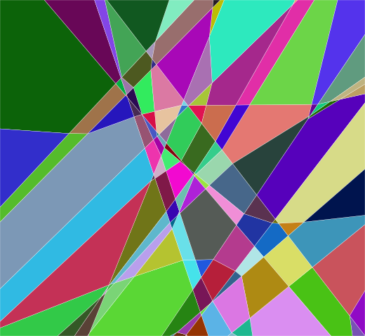

# analysis-relu-network

A sample library for linear graph (weight and bias) of DNNs in [PyTorch](https://pytorch.org/). Now the library supports a few of modules. We are trying to make this library work like PyTorch.

## Features

- An thin extension of PyTorch's Module, called AysBaseModule, that simplifies the creation of certain graph models. See the example for an example using AysBaseModule.
- This library can generate the linear graph of DNNs easily by forward process.

## Support modules

```python
__all__ = [
    'AysReLU',
    'AysBaseModule', # baseModule for inheritance.
    'AysBatchNorm1d', 'AysBatchNorm2d', 'AysBatchNorm3d',
    'AysSequential',
    'AysConv2d',
    'AysLinear',
    'AysAvgPool2d',
]
```

`We will update this library to support more modules.`

## Requirements

- Python 3.10 or above
- PyTorch 1.6 or above
- Scipy 1.5.4 or above
- Numpy
- matplotlib
- polytope

## Example

### Sample example

This example shows how to create a module to generate the linear graph. This example is in [graphDemo.py](examples/graphDemo.py).

```python
import torch
from torchays import nn

class TestNet(modules.Module):
    def __init__(self):
        super(TestNet, self).__init__()
        self.relu = nn.ReLU()
        self.conv1 = nn.Conv2d(in_channels=3, out_channels=8, kernel_size=3, stride=2, padding=1)
        self.bn1 = nn.BatchNorm2d(num_features=8)
        self.conv2 = nn.Conv2d(in_channels=8, out_channels=16, kernel_size=3, stride=2, padding=1)
        self.avg = nn.AvgPool2d(2, 1)
        self.linear = nn.Linear(16, 2)

    def forward(self, x):
        x = self.conv1(x)
        x = self.bn1(x)
        x = self.relu(x)

        x = self.conv2(x)
        x = self.avg(x)

        x = self._forward(lambda x: torch.flatten(x, 1), x)
        x = self.linear(x)
        return x

    def forward_graph(self, x, weight_graph=None, bias_graph=None):
        input_size = self._get_origin_size(x, weight_graph)
        bias_graph = bias_graph.reshape(bias_graph.size(0), -1)
        weight_graph = weight_graph.reshape(weight_graph.size(0), -1, *input_size)
        return weight_graph, bias_graph


data = torch.randn(2, 3, 8, 8)
net = TestNet().to(device)

""" 
If the net needs to be trained, net can use 'net.train()' which cannot genarate the graph. 'net.eval()' uses to validation or test net without graph. 'net.graph()' will genarate the graph, and the output of the network is a tuple with result of network and a dict about network graph with 'weight_graph' and 'bias_graph'.
"""
net.graph()
with torch.no_grad():
    output, graph = net(data)
    weight_graph, bias_graph = graph.get("weight_graph"), graph.get("bias_graph")
    print(output)
    for i in range(output.size(0)):
        output = (weight_graph[i] * data[i]).sum(dim=(1, 2, 3)) + bias_graph[i]
        print(output)
```

### Linear Regions of ReLU DNNs

The utils class "`ReLUNet`" in "[compute.py](torchays/analysis/compute.py)" can get the number and functions of the Linear Regions of ReLU DNNs which only has ReLU activation in the framework without the other non-linearity layers.

In "[regionsDemo.py](examples/regionsDemo.py)", a smaple implementation is shown to get the linear regions number of the ReLU DNN and draw the linear regions by the 2D data.

#### A region image

The data learned by the DNN have the bound (-1< x <1) in our examples.


